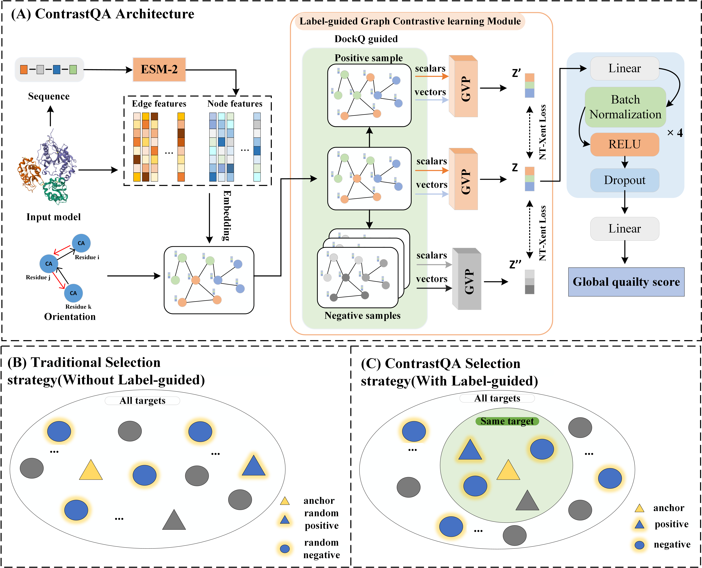

# ContrastQA: A Label-guided Graph Contrastive Learning-based approach for protein complex structure quality assessment

<div align="center">
  
</div>

We propose the ContrastQA method, based on the label-guided graph contrastive learning framework. ContrastQA devises a novel positive-negative samples pair selection strategy utilizing the interface score label DockQ and also gives a modified contrast loss function to fit this task, which is combined with the geometric graph neural network GVP-GNN for contrastive learning to enhance the model representation and thus improve the global quality assessment of protein complexes. 

## Installation

```bash
# clone the repo
git clone https://github.com/Cao-Labs/ContrastQA.git
cd ContrastQA
```
We use python 3.9.19, pytorch 2.2.1 and pytorch-lightning 2.3.0. We recommend using conda to install the dependencies:
```bash
conda env create -f environment.yml
```
Activate conda environment
```bash
conda activate ContrastQA
```
You also need to install the relative packages to run ESM-2 protein language model. \
Please see [facebookresearch/esm](https://github.com/facebookresearch/esm) for details. 
